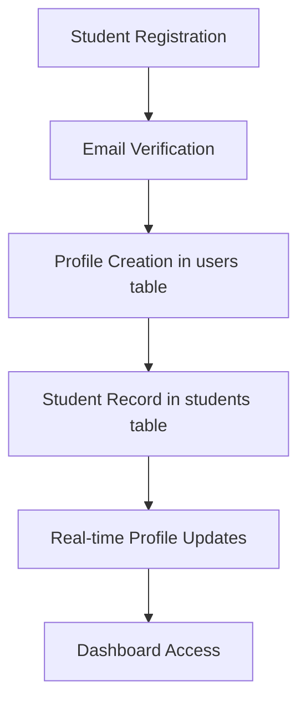
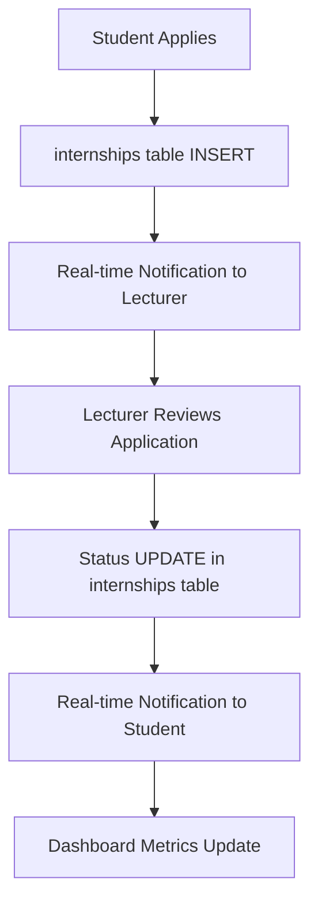
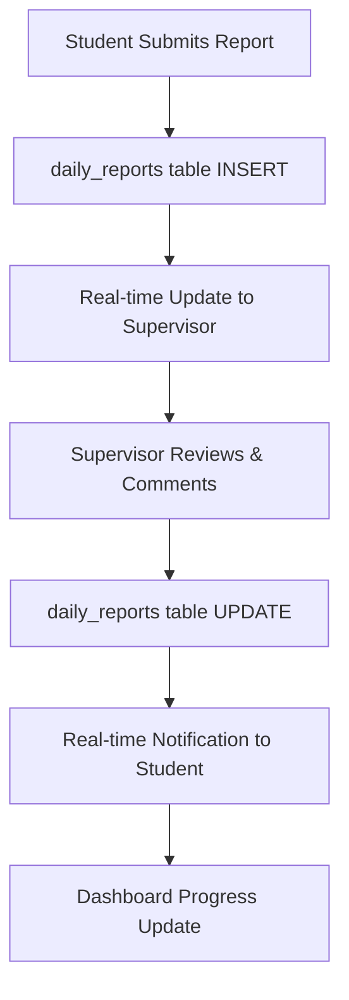
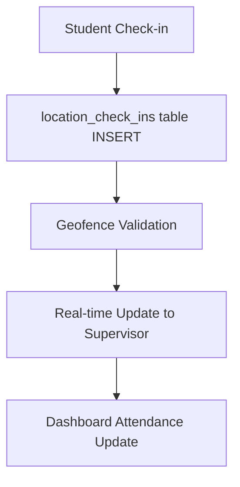

# Complete User Flow with Real-time Database

This document outlines how all user flows are synchronized with the Supabase real-time database.

## 🔄 Real-time Features Overview

### 1. **Authentication Flow**
- **Login**: Uses Supabase Auth with automatic session management
- **Registration**: Creates user in `auth.users` and profile in `public.users`
- **Real-time**: Auth state changes are automatically synchronized across tabs
- **Profile Updates**: User profile changes reflect immediately across the system

### 2. **Student Registration & Verification**


**Real-time Components:**
- Profile completion triggers real-time updates to dashboard metrics
- Verification status changes broadcast to admin dashboards
- Student list updates automatically when new students register

### 3. **Internship Management Flow**


**Real-time Features:**
- **Application Submission**: Immediate notification to assigned lecturers
- **Status Changes**: Real-time updates to student and supervisor dashboards
- **Metrics**: Live count of pending/approved/active internships

### 4. **Daily Reports & Tasks**


**Real-time Features:**
- **Report Submission**: Instant visibility to supervisors and lecturers
- **Comments & Ratings**: Real-time feedback exchange
- **Progress Tracking**: Live updates to completion percentages

### 5. **Location Check-ins**


**Real-time Features:**
- **Location Verification**: Immediate validation and alerts
- **Attendance Tracking**: Live attendance dashboards
- **Geofence Alerts**: Real-time notifications for out-of-bounds check-ins

## 🎯 User Role Flows

### **Student Flow**
1. **Registration** → Real-time profile creation
2. **Profile Completion** → Live verification status
3. **Internship Application** → Real-time status tracking
4. **Daily Activities** → Live progress updates
5. **Location Check-ins** → Instant verification
6. **Report Submission** → Real-time feedback loop

### **Lecturer Flow**
1. **Dashboard Overview** → Live metrics and alerts
2. **Student Management** → Real-time student list updates
3. **Internship Approval** → Instant status broadcasting
4. **Report Review** → Live submission notifications
5. **Progress Monitoring** → Real-time analytics

### **Company Supervisor Flow**
1. **Student Oversight** → Live activity monitoring
2. **Task Assignment** → Real-time task distribution
3. **Report Review** → Instant submission alerts
4. **Location Monitoring** → Live check-in tracking
5. **Evaluation** → Real-time feedback system

### **Admin Flow**
1. **System Overview** → Comprehensive live dashboard
2. **User Management** → Real-time user activity
3. **Company Management** → Live partnership tracking
4. **Issue Management** → Instant issue notifications
5. **Analytics** → Real-time system metrics

## 🔧 Technical Implementation

### **Real-time Hooks**
```typescript
// Dashboard metrics with live updates
const { data: students, loading } = useRealtimeStudents();
const { data: internships } = useRealtimeInternships();
const { data: reports } = useRealtimeDailyReports();

// User-specific data
const { data: userInternships } = useRealtimeInternships(userId);
const { data: userReports } = useRealtimeDailyReports(internshipId);
```

### **Real-time Subscriptions**
```typescript
// Table-level subscriptions
supabase
  .channel('internships')
  .on('postgres_changes', { event: '*', schema: 'public', table: 'internships' }, 
    (payload) => {
      // Handle real-time updates
    }
  )
  .subscribe();
```

### **Broadcast Messaging**
```typescript
// Cross-user notifications
const { broadcast, subscribe } = useRealtime();

// Send notification
broadcast('notification', {
  type: 'internship_approved',
  studentId: 'uuid',
  message: 'Your internship has been approved!'
});

// Receive notifications
subscribe('notification', (payload) => {
  showToast(payload.message);
});
```

## 📊 Real-time Dashboard Features

### **Live Metrics**
- Total students (updates as new registrations occur)
- Active internships (changes with status updates)
- Recent reports (updates as submissions come in)
- Check-in statistics (live location tracking)
- System issues (real-time issue reporting)

### **Real-time Alerts**
- New internship applications
- Overdue reports
- Missing check-ins
- System issues
- Evaluation deadlines

### **Live Notifications**
- Application status changes
- New task assignments
- Report feedback
- Check-in confirmations
- System announcements

## 🔐 Row Level Security (RLS)

### **Data Access Control**
- Students can only see their own data
- Lecturers can see assigned students
- Supervisors can see company interns
- Admins have full system access

### **Real-time Security**
- RLS policies apply to real-time subscriptions
- Users only receive updates for data they can access
- Secure broadcasting with role-based filtering

## 🚀 Performance Optimizations

### **Efficient Subscriptions**
- Filtered subscriptions to reduce bandwidth
- Automatic unsubscription on component unmount
- Batched updates to prevent UI flickering

### **Caching Strategy**
- Local state management with real-time updates
- Optimistic updates for better UX
- Background synchronization

### **Error Handling**
- Graceful fallbacks for connectivity issues
- Retry mechanisms for failed operations
- User-friendly error messages

## 📱 Mobile Responsiveness

### **Real-time Mobile Features**
- Push notifications for critical updates
- Offline mode with sync on reconnection
- Touch-optimized real-time interfaces
- GPS integration for location services

## 🔄 Data Synchronization

### **Conflict Resolution**
- Last-write-wins for simple updates
- Merge strategies for complex data
- User notification for conflicts

### **Offline Support**
- Local storage for critical data
- Queue for offline operations
- Automatic sync on reconnection

This comprehensive real-time system ensures that all users have immediate access to the latest information, creating a seamless and responsive internship management experience.
